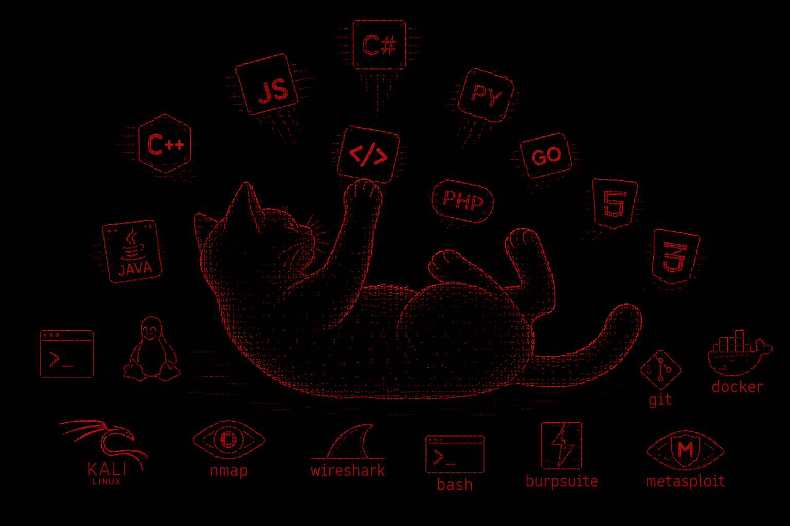

<h1 align="center">Hi, I'm Federico Garcia 👋</h1>

  

---

## 🌐 Contact

  <a href="mailto:fedeg3663@gmail.com">Email</a>

---

## 💻 Tech Stack

### Languages

  

### Databases

  
  
  

### Frameworks & Libraries

  
  
  
  

### Tools

  

---
